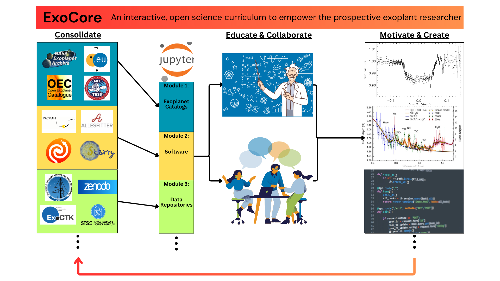

# ExoCore

ExoCore is part of NASA's Transform to Open Science (TOPS) initiative which aims to provide a transparent and comprehensive curriculum covering the key tools, methods, and practices in the exoplanet field through the use of interactive Jupyter notebooks. In such a rapidly expanding field, one of ExoCore's primary goals is to give aspiring and current researchers exposure to the state-of-the-art workflows which will expedite their ability to contribute to the field. ExoCore fulfills this goal in a few ways: participants can actively practice these workflows, providing important 'hands-on' engagement; the lessons are filled with descriptive visuals, providing enriching context to potentially abstract and technical processes; the lessons are supplemented with hyperlinks that provide additional resources outside the scope of the lessons or provide alternative approaches to the methods or problems being taught.

