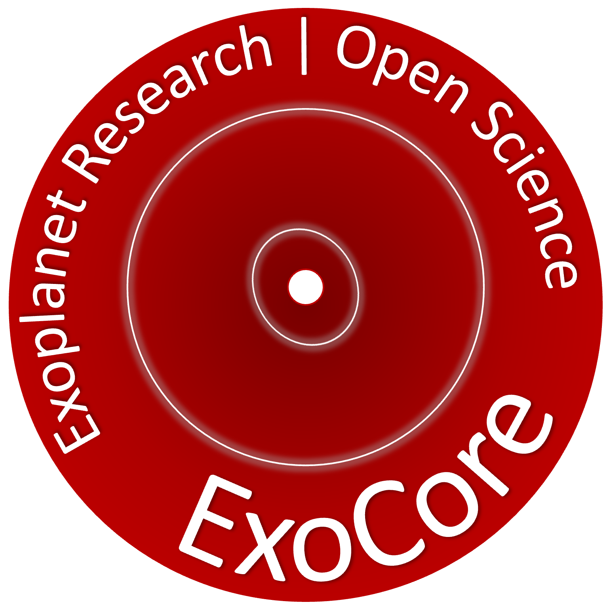
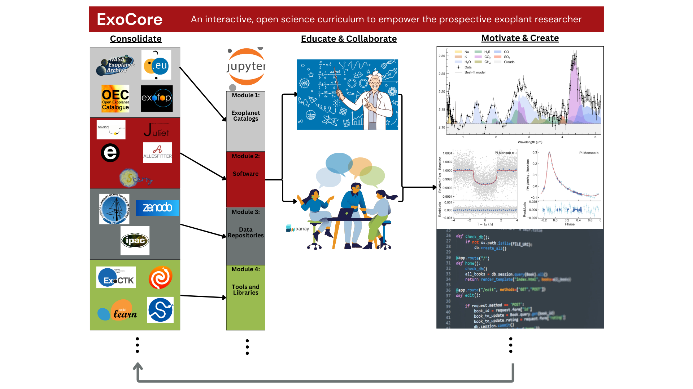

# ExoCore

  

# Introduction
ExoCore is a curriculum of open science for the field of exoplanets developed as part of [NASA's Transform to Open Science (TOPS)](https://nasa.github.io/Transform-to-Open-Science/) initiative. It complements [TOPS OpenCore 101](https://nasa.github.io/Transform-to-Open-Science/take-os101/) to provide a transparent and comprehensive curriculum covering the key tools, methods, and practices in the exoplanet research field through the use of interactive Jupyter notebooks. In a rapidly expanding field, ExoCore's primary goal is to give aspiring and current researchers exposure to the state-of-the-art workflows to expedite their ability to contribute to the field. As a component of [ScienceCore](https://www.nasa.gov/centers-and-facilities/marshall/nasa-boosts-open-science-through-innovative-training/), ExoCore fulfills this goal in several ways: participants can actively practice these workflows, providing important 'hands-on' engagement; the lessons are filled with descriptive visuals, providing enriching context to potentially abstract and technical processes; the lessons are supplemented with hyperlinks that provide additional resources outside the scope of the lessons or provide alternative approaches to the methods and tools being taught.

# Intended Learning Outcomes
To help potential students decide if ExoCore is appropriate for their research goals, the following enumerate what ExoCore **is** and what it **is not**.

**ExoCore ***is*****:
* **a modular cirriculum aimed towards advanced undergraduates and beginning graduate students with basic proficiency in ***Python*****.
* **a useful tool to learn specific research workflows (e.g. transit modeling, spectroscopy reduction)**.
* **a general hub and pointer for open software, resources, and collaborations in exoplanet research**.
* **able to jump-start students to engage in current research**.
* **non-linear, so lessons can be (mostly) done independently**.

**ExoCore** ***is not***:
* **a ***Python*** course**.
* **a physics/math course (does not discuss, e.g., Hamiltonians, equation derivations, formation theories)**.
* **exhaustive. The lessons contain **primary** functionality and use-cases. Students are encouraged to dig deeper and use the hyperlinked resources to get the most out of their experience**.

# Modules

ExoCore is divided into **seven** modules that categorizes lessons based on a particular aspect of exoplanet research. They include:

* Databases
* Data Repositories
* Data Structures
* Data Analysis and Modeling Software
* Utility Software
* Citizen Science
* Exoplanet Resources and Collaborations

Further information on module content and specific lessons can be found in the main [ExoCore](./ExoCore/ExoCore.ipynb) Jupyter notebook.

# Pre-curricular survey

# Post-curricular survey

# Accessing ExoCore
You can explore ExoCore using Binder. Clicking the button below will generate a Docker image of ExoCore on BinderHub. The initialization process will take about two minutes.

# Contributing to ExoCore

# Credits

# Citing ExoCore
