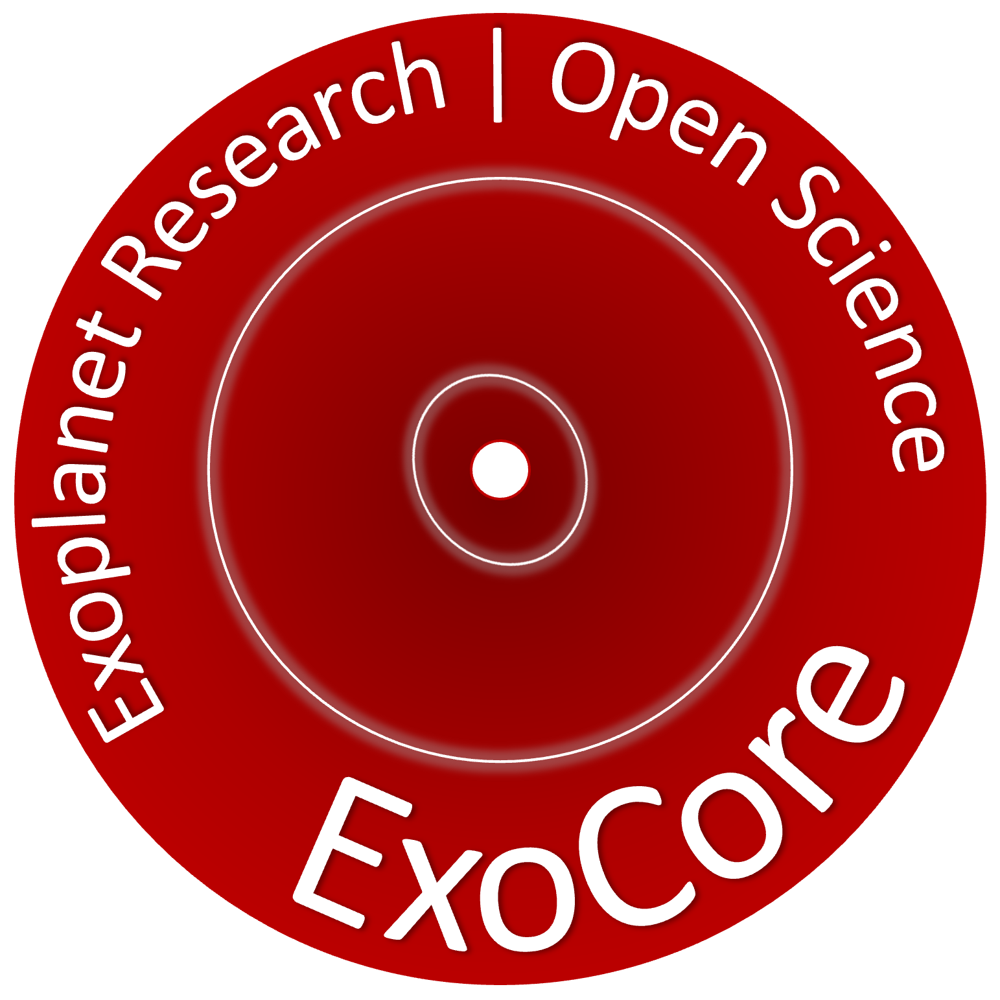
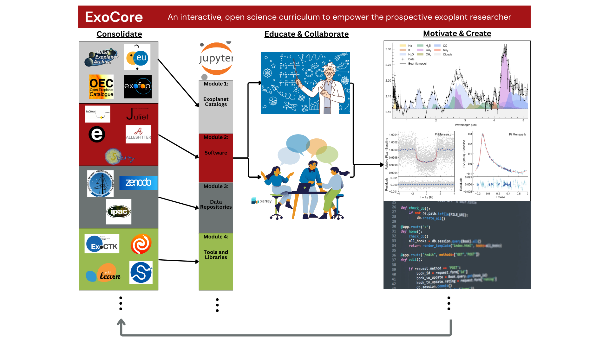

# ExoCore

  

# Introduction
ExoCore is an open-science curriculum for advanced undergraduate students, beginning graduate students, and researchers entering exoplanet science. Developed as part of NASA ScienceCore, it complements Open Science 101 with interactive Jupyter notebooks on catalogs, data archives, scientific Python, analysis software, citizen science, and research communities. Each lesson connects a scientific task to reproducible inputs, methods, outputs, and provenance.

# Intended Learning Outcomes

After completing relevant ExoCore modules, learners should be able to
* locate and evaluate exoplanet catalogs, observations, software, and professional resources,
* reproduce a documented workflow while preserving units, metadata, dependencies, and provenance,
* adapt a worked example to a related research question and justify each major analysis choice.

ExoCore is aimed toward advanced undergraduates and beginning graduate students.

Please refer to [this presentation](https://astromusers.wustl.edu/AAS245_ExoCore_Workshop_Presentation_20250113.pptx) and [worksheet](https://astromusers.wustl.edu/AAS245_ExoCore_Workshop_Handout_20250113.pdf) of a workshop our team organized during AAS 245 in National Harbor, Maryland, on January 13, 2025, sponsored by an AAS Education & Professional Development (AAS-EPD) grant.

# Modules
ExoCore is divided into **seven** modules that categorize lessons based on a particular aspect of exoplanet research. They include:

* Catalogs
* Data Repositories
* Data Structures
* Data Analysis and Modeling Software
* Utility Software
* Citizen Science
* Exoplanet Resources and Collaborations

Module descriptions, learning outcomes, activities, and lesson links are available in the canonical [ExoCore curriculum](./ExoCore/Curriculum/ExoCore.ipynb) notebook.

# Planned curriculum surveys
We plan to add a pre-curricular survey that recommends modules based on each learner's goals and prior experience. The planned survey has two parts:

1. Learning Outcomes and Familiarity Survey
2. Pre-Curricular Assessment

The first part will identify relevant topics and workflows. The second will assess prerequisite knowledge and suggest an ordered learning pathway. Until this survey is available, learners should begin with the lesson most relevant to their goal and complete any prerequisites stated in that lesson.

We also plan to add a post-curricular survey that measures learning outcomes and collects feedback on completed lessons.

# Accessing ExoCore
You can explore ExoCore using Binder. Clicking the button below will generate a Docker image of ExoCore on BinderHub. The initialization process will take about two minutes.

# Contributing to ExoCore
We look forward to updating and expanding ExoCore, particularly through contributions from early-career researchers who have faced and overcome challenges associated with familiarizing themselves with the field. If you are interested in contributing to the ExoCore curriculum, please reach out via email at `tansu@wustl.edu`.

# ExoCore Team
ExoCore is developed by members of AstroMusers in the Department of Physics at Washington University in St. Louis. Nathan Whitsett and Bryce Wedig are the leading developers. The other contributors to ExoCore include Ekrem Esmer, Zifan Lin, Jackie Vazquez, Aavik Wadivkar, Gabriella Jager, and Sophia Acker. Tansu Daylan is the principal investigator.

# Citing ExoCore
You can cite ExoCore and its contributors using the "Cite this repository" drop-down in the "About" section of ExoCore's [GitHub page](https://github.com/AstroMusers/ExoCore).

# Funding Acknowledgment
We acknowledge support from NASA through the grant 80NSSC23K0865 and by the McDonnell Center for the Space Sciences (MCSS) at Washington University in St. Louis.
